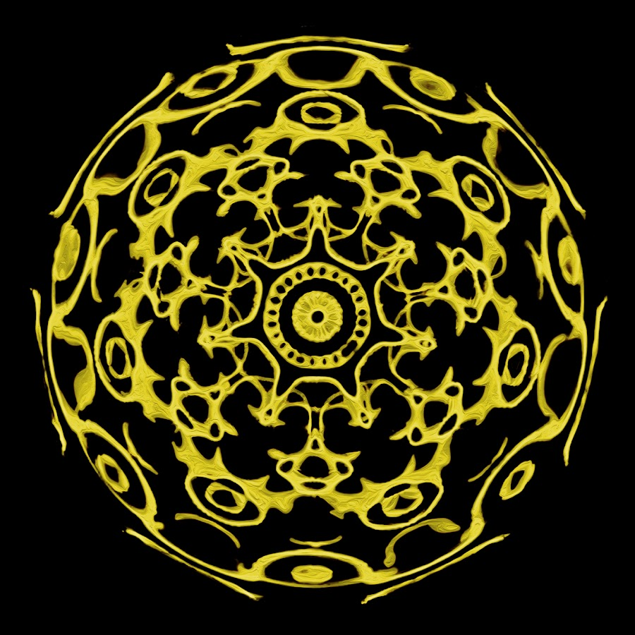

<!-- Astrano Logo and Welcome Message -->

  
  <h1>Welcome to Astrano</h1>

🌟 Embark on a transformative journey of spiritual self-discovery and growth with Astrano, a non-profit organization dedicated to enhancing your inner well-being.

Visit the deployed version of Astrano: [https://astrano.vercel.app/](https://astrano.vercel.app/)

## About Astrano

Astrano is a dynamic platform designed to help you unlock your spiritual potential. Our mission is to provide a seamless learning experience that empowers individuals to enhance their inner well-being.

## 🌠 Key Features

### Home Page

Our welcoming home page serves as your gateway to the world of spiritual self-development. Immerse yourself in inspiring content and explore the tools to nurture your inner self.

### Contact Us

Connect with us through our dedicated contact page. Have questions or feedback? Reach out to us - we're here to support you!

### About Us

Learn more about Astrano and the passionate team behind it. Our commitment to facilitating personal growth drives us forward.

### Donation

Support the Astrano initiative through secure donations. Your contributions help us continue our mission of fostering spiritual well-being for all.

## 🚀 Upcoming Features

While Astrano is already a valuable resource for spiritual seekers, we have exciting plans on the horizon:

### Training

Embark on a comprehensive journey of self-discovery with our upcoming Training page. Explore a structured curriculum designed to enhance your understanding of spiritual practices.

### Astral Quests

Coming soon are Astral Quests - immersive experiences that allow you to connect with your inner self on a deeper level.

## Stay Connected

Join our community of spiritual seekers by subscribing to Astrano:

- Follow us on Instagram: [@officialastrano](https://www.instagram.com/officialastrano)
- Explore our Linktree: [Astrano Linktree](https://linktr.ee/astrano)

---

Thank you for considering Astrano as your companion on your spiritual journey. We're committed to guiding you towards inner harmony and self-discovery. Stay tuned for updates as we continue to enhance your path of spiritual growth!
